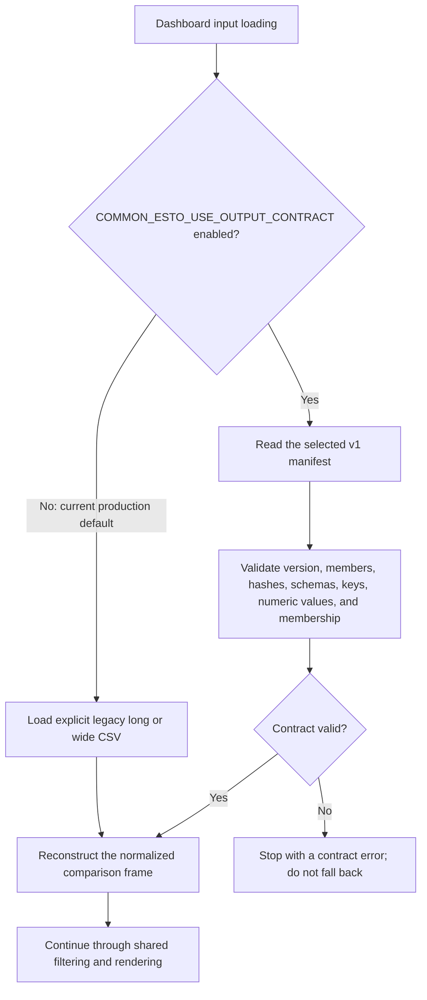

# Common ESTO output contract migration

**Status reviewed:** 2026-08-03

## Integrated strict opt-in support

The dashboard has strict, explicit opt-in support for
`common_esto_output_contract.json` version `common_esto_output_contract_v1`.
The contract provides an observed-row narrow fact table and compound-keyed
Common ESTO row metadata. The loader validates the manifest, member identity,
schemas, keys, numeric values, and complete fact/metadata membership before
reconstructing the existing denormalized dashboard input.

The legacy long and wide CSV adapters remain the production default. Set
`COMMON_ESTO_USE_OUTPUT_CONTRACT=1` to select the contract and optionally set
`COMMON_ESTO_OUTPUT_CONTRACT_PATH` to an alternate manifest. A selected invalid
contract fails without falling back to legacy data.

Both routes converge on the same normalized frame. The strict stop is
intentional: silent fallback would make a run appear contract-backed when it
actually consumed an unrelated legacy file.

The producer and consumer implementations are integrated on the local
`master` branches. The recorded `20USA`/`02BD` legacy-versus-contract
equivalence run passed. Existing mapping result files predate contract
publication, so the contract is not yet the ordinary production default.

## Production-soak evidence

Two independently dated all-economy contract candidates have now passed.

| Run | Contract input | Dashboard input | Result |
|---|---|---|---|
| 1 — 2026-07-28 | `common_esto_20260728T035935111268Z`; 3,952,646 facts | isolated contract-soak branch | 21/21 economies, 6,510 charts, 1,020,120 visible rows, readiness passed |
| 2 — 2026-08-03 | `common_esto_20260803T053714732123Z`; 3,887,707 facts and 6,127 metadata rows | committed dashboard `8ad51dc` | 21/21 economies, 10,212 charts, 978,809 visible rows, readiness passed |

Run 2 used fact SHA-256
`246c48b13018dcb823759960634b694369c1ed0c7d4db332e9fcca72bd30cb4b`
and metadata SHA-256
`63e4ce55c7d6389aa0c4dab7419d04e507d264fd59e73d710b089b6c00d68bfa`.
The same-generation 985,559,800-byte legacy comparison was retained with
SHA-256
`b9b1e1f4afd23342171748e06a6adf3339ad5c3638b29aa48830311b47a95feb`.

Run 2's page-noise review retained seven flags: `02BD` Others, `04CHL`
Others, `05PRC` Industry, `06HKC` Others, `09ROK` Industry, `12NZ` Others,
and `20USA` Industry. A targeted same-generation legacy control produced
byte-identical chart manifests and sign-semantics summaries for all seven
economies, plus identical render counts, 69 page-noise rows, and all seven
flags. Nothing was suppressed to make the gate pass.

Run 1's isolated retry also resolved a Python package-name collision between
the dashboard and mappings `codebase` packages by loading the mappings
preflight module from its configured file path under a unique module name.
The corresponding regression test remains part of the dashboard boundary suite.

The Stage 3 manifest status was `completed`. It also retained non-blocking QA
findings: Common ESTO flow-hierarchy mismatches for ESTO Extended (85), LEAP
(8), and 9th (202), product checks with no eligible parent/child cases, and
anchor findings across overlapping scopes. These findings were not summed
across scopes and do not indicate a missing or structurally invalid contract.

## Remaining integration gate

The two-run compatibility gate is satisfied, but the legacy adapter remains
the ordinary default. Default selection must be a separate reviewed change.
Before that change, reconcile the current uncommitted dashboard renderer/data
work and repeat affected checks if those edits materially alter chart or input
semantics. DASHQ-007 in [`work_queue.md`](work_queue.md) separately retains its
clean mapping code/artifact provenance requirement. Do not retire the legacy
rollback merely because the two compatibility soaks passed.

## Phase 2 disposition

- Mapping diagnostics receives the workflow's normalized comparison frame;
  compressed diagnostic artifacts are separate, manifest-declared upstream
  evidence rather than v1 fact-table members.
- Maintained QA readers use the shared loader.
- Optional economy-partition discovery/selective loading is deferred until a
  producer contract declares such partitions.
- The representative equivalence gate is complete; the all-economy gate remains
  part of DASHQ-007.

Completed:

- Pipeline provenance identifies the explicitly selected contract run and warns
  when a failed or different latest Stage 3 attempt preserved an older contract.
- The mapping-pipeline health report shows selected contract identity, declared
  fact/metadata freshness, and the same preserved-contract divergence warning.
- Sankey routing QA and fixture refresh use the shared comparison-data loader,
  retain legacy defaults, and fail without fallback when a contract is selected.
- Production mapping diagnostics and the full-tree explorer already receive the
  workflow's normalized comparison frame, so they need no separate reader.
- Real legacy/contract renders matched exactly for `20USA` and `02BD`: 390 charts,
  3,427 traces, equal manifests, page assignments, sign summaries, normalized
  chart series, and zero page-noise flags. Both formats passed publication
  readiness after suppressing empty area figures.

Deferred investigation readers:

- `render_transformation_rollup_diagnostics_prototype.py`
- `render_mapping_tree_explorer_prototype.py`

These investigation prototypes still read fixed artifacts directly. Migrating
them is deferred until they are promoted into a maintained production workflow.
`render_full_mapping_tree_explorer.py` is the maintained full-tree renderer;
the similarly named prototype is retained only for comparison.

The fixture updater still copies `common_esto_rows.csv` as a supplemental
component-membership fixture. V1 contract metadata is deliberately one row per
compound key and does not contain the component-grain fields used by mapping
diagnostics; replacing that file would require a future metadata contract.
