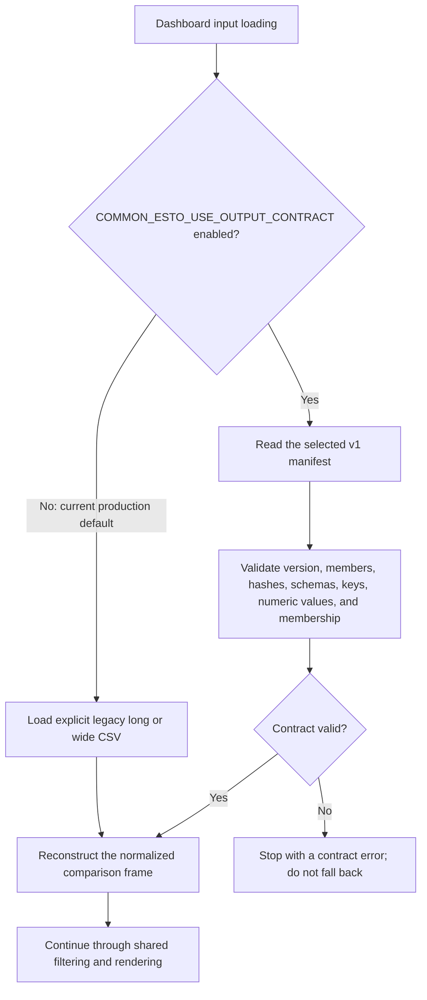

# Common ESTO output contract migration

**Status reviewed:** 2026-07-28

## Integrated strict opt-in support

The dashboard has strict, explicit opt-in support for
`common_esto_output_contract.json` version `common_esto_output_contract_v1`.
The contract provides an observed-row narrow fact table and compound-keyed
Common ESTO row metadata. The loader validates the manifest, member identity,
schemas, keys, numeric values, and complete fact/metadata membership before
reconstructing the existing denormalized dashboard input.

The legacy long and wide CSV adapters remain the production default. Set
`COMMON_ESTO_USE_OUTPUT_CONTRACT=1` to select the contract and optionally set
`COMMON_ESTO_OUTPUT_CONTRACT_PATH` to an alternate manifest. A selected invalid
contract fails without falling back to legacy data.

Both routes converge on the same normalized frame. The strict stop is
intentional: silent fallback would make a run appear contract-backed when it
actually consumed an unrelated legacy file.

The producer and consumer implementations are integrated on the local
`master` branches. The recorded `20USA`/`02BD` legacy-versus-contract
equivalence run passed. Existing mapping result files predate contract
publication, so the contract is not yet the ordinary production default.

## Remaining operational gate

The first dated all-economy candidate has passed. DASHQ-026 in
[`work_queue.md`](work_queue.md) still requires a second independently dated
candidate before any reviewed change may make v1 the ordinary default or
retire the legacy comparison. A successful first soak does not prove a later
generation is publishable.

### Production soak Run 1 — passed 2026-07-28

- Selected strict contract: run ID
  `common_esto_20260728T035935111268Z`, mappings revision `86b1162`,
  3,952,646 facts.
- Result: 21/21 economies `ok`, 6,510 charts, 1,020,120 visible rows, zero
  stderr, and publication readiness passed.
- Isolation: output remained under
  `outputs/common_esto_contract_soak_run_1_20260728`; no tracked serving assets
  were published.
- Rollback: the same-generation legacy comparison remains present at
  975,673,793 bytes.
- Page-noise result: five `high_suppressed_share` rows were retained for
  `04CHL`, `12NZ`, `14PE`, and `18CT`. A same-generation legacy control for
  those economies produced byte-identical chart manifests and sign summaries,
  equal chart and visible-row counts, and exactly equal page-noise output.
  These flags are producer-generation structure, not contract-format changes.
- Reversible fix: the preserved first attempt exposed a Python package-name
  collision between dashboard and mappings `codebase` packages. The retry
  loads mappings' self-contained source-branch preflight module by configured
  file path under a unique name. The failure logs and failed summary remain
  available beside the successful run.

## Phase 2 disposition

- Mapping diagnostics receives the workflow's normalized comparison frame;
  compressed diagnostic artifacts are separate, manifest-declared upstream
  evidence rather than v1 fact-table members.
- Maintained QA readers use the shared loader.
- Optional economy-partition discovery/selective loading is deferred until a
  producer contract declares such partitions.
- The representative equivalence gate is complete; the all-economy gate remains
  part of DASHQ-007.

Completed:

- Pipeline provenance identifies the explicitly selected contract run and warns
  when a failed or different latest Stage 3 attempt preserved an older contract.
- The mapping-pipeline health report shows selected contract identity, declared
  fact/metadata freshness, and the same preserved-contract divergence warning.
- Sankey routing QA and fixture refresh use the shared comparison-data loader,
  retain legacy defaults, and fail without fallback when a contract is selected.
- Production mapping diagnostics and the full-tree explorer already receive the
  workflow's normalized comparison frame, so they need no separate reader.
- Real legacy/contract renders matched exactly for `20USA` and `02BD`: 390 charts,
  3,427 traces, equal manifests, page assignments, sign summaries, normalized
  chart series, and zero page-noise flags. Both formats passed publication
  readiness after suppressing empty area figures.

Deferred investigation readers:

- `render_transformation_rollup_diagnostics_prototype.py`
- `render_mapping_tree_explorer_prototype.py`

These investigation prototypes still read fixed artifacts directly. Migrating
them is deferred until they are promoted into a maintained production workflow.
`render_full_mapping_tree_explorer.py` is the maintained full-tree renderer;
the similarly named prototype is retained only for comparison.

The fixture updater still copies `common_esto_rows.csv` as a supplemental
component-membership fixture. V1 contract metadata is deliberately one row per
compound key and does not contain the component-grain fields used by mapping
diagnostics; replacing that file would require a future metadata contract.
