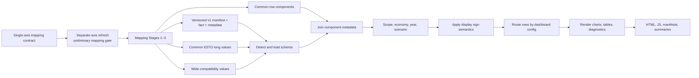

# Common ESTO dashboard pipeline guide

**Verified:** 2026-07-28

**Audience:** analysts, dashboard maintainers, and reviewers

**Authority:** Level 1 operating guide for Common ESTO dashboard ingestion,
rendering, diagnostics, and publication

**Use this when:** rendering or reviewing dashboard outputs. For
cross-repository ownership and execution order, start at
[`leap_mappings/docs/start_here.md`](../../../leap_mappings/docs/start_here.md).

This repository presents Common ESTO comparison outputs. Mapping semantics
belong to `leap_mappings`; LEAP preparation belongs to `leap_initialisation`.

## Pipeline



## Inputs and compatibility

Default inputs come from the sibling mappings repository:

| Input | Purpose |
|---|---|
| `results/common_esto/common_esto_output_contract.json` | strict opt-in v1 manifest; declares and hashes narrow fact and compound-keyed metadata members |
| `results/common_esto/common_esto_comparison_data.csv` | primary long comparison values |
| `results/common_esto/common_esto_rows.csv` | component membership and generated-row metadata |
| exact ESTO and ESTO Extended compressed rows | diagnostics/raw-value overlays |
| mapping QA/tree/anchor files | diagnostics page and tree explorer |
| `leap_mappings/config/all_demand_aggregated_components.json` plus the upstream mapping helper | per-economy demand-detail availability |

The loader accepts:

- `common_esto_output_contract_v1` when explicitly selected;
- long data when all required long columns exist;
- wide data when the required identity and year columns exist.

Set `COMMON_ESTO_USE_OUTPUT_CONTRACT=1` to select v1 and optionally set
`COMMON_ESTO_OUTPUT_CONTRACT_PATH`. Selection is strict: an invalid manifest,
hash, schema, key, numeric value, or fact/metadata membership fails without a
legacy fallback. Legacy long/wide loading remains the default during the
transition.

Wide data requires one `comparison_scope`; it folds source system into
scenario. Long data is preferred because it retains explicit source system and
does not zero-fill missing source years.

`LEAP_MAPPINGS_ROOT`, input paths, comparison scope, economies, and several
display options have environment overrides.

## Preprocessing

The production workflow:

1. normalizes economy keys to compact form (`20_USA` → `20USA`);
2. reads long or wide Common ESTO data;
3. joins component metadata from `common_esto_rows.csv`;
4. removes 9th pre-base-year rows by default so ESTO is the historical
   comparator;
5. filters comparison scope, economy, and 2010–2060 by default;
6. applies visible-series configuration;
7. applies presentation sign semantics;
8. retains all scopes separately for optional diagnostic scope pages.

The authoritative economy/name list is
`config/common_esto_dashboard/series_config.json`. `02BD`/`02_BD` means Brunei
Darussalam.

## Measures and chart semantics

The renderer calculates:

- total absolute value;
- historical LEAP minus ESTO differences;
- projection LEAP minus 9th differences, by scenario;
- percentage differences, with current queue items tracking richer warning and
  ranking metadata;
- page/section chart counts and suppression state.

Missing long-form LEAP values are not converted to zero before difference
pairing. Sign rules are presentation rules: for example, exports can be shown
as removed from domestic supply while source/conversion sign meaning remains
owned upstream.

## Hierarchy, subtotals, and rollups

The dashboard treats `comparison_scope`, common flow/product labels, and
component metadata as its axes. It must not infer upstream membership from
display text.

Line charts use a non-overlapping frontier helper to avoid plotting additive
parents and children as if independent. Total-demand and aggregate charts use
configured reviewed boundaries. Non-expanding rollups and generated categories
retain upstream component evidence.

If a category exists upstream but cannot be placed, first verify its component
membership in `leap_mappings`, then adjust dashboard routing. Never add a
dashboard-only mapping.

## Page and series configuration

Production configuration is under `config/common_esto_dashboard/`:

| File | Role |
|---|---|
| `common_esto_dashboard_template.json` | page rules, chart generation, signs, total-demand and scope pages |
| `series_config.json` | visible series, labels, economies, dashboard switcher |
| `code_colors.json` | stable code-based colours |

Page rules assign rows to Supply, Power, Refining, Transport, Industry,
Buildings, Other demand, Other transformation, and other configured sections.
Per-economy demand pages can be hidden when the mappings-owned coverage config
says LEAP has only aggregate detail.

The approved systematic replacement for the current priority/keyword routing
is documented in
[`../dashboard_page_routing_and_chart_visibility.md`](../dashboard_page_routing_and_chart_visibility.md).
It defines boundary-safe page roots, most-specific-root ownership, exact
routing special cases, one builder per page, and the separate chart-level
dataset-presence filter contract. Treat that document as the migration target,
not as a claim that every part is already implemented.

## Rendering and outputs

Per-economy output:

```text
outputs/common_esto_dashboard/<economy>/
  dashboards/
  chart_bundles/
  supporting_files/
```

Supporting evidence includes:

- `chart_manifest.csv`;
- `page_assignment_summary.csv`;
- `sign_semantics_summary.csv`;
- `mapping_diagnostics_summary.csv`;
- `dashboard_metadata.json`.

The manifest retains suppressed charts with `suppressed=true`, so display
suppression is auditable. The mapping diagnostics page and full tree explorer
are diagnostic presentation; they do not modify mapping artifacts.

`dashboard_metadata.json` is the per-economy provenance boundary. It records
the selected Common ESTO mapping run ID and timestamp, output-contract kind and
path, and the Stage 3 status only when that status belongs to the same run.
All-economy production checks must confirm every rendered economy carries the
same selected upstream run rather than independently resolving a newer or older
artifact.

## Caching, regeneration, and incremental behavior

Ordinary rendering reads existing upstream values and rebuilds the selected
economy output. `CLEAR_EXISTING_OUTPUTS=True` clears that economy’s generated
dashboard/chart/supporting folders before writing.

`UPDATE_DATA=True` is an opt-in Common ESTO fast path. It writes into the
sibling mappings repository but does not run separate-axis generation,
Stages 1–2, or deep validation. It is not a full mapping run and must not
overlap Stage 3.

There is no content-addressed incremental chart cache in the main workflow; an
economy render regenerates its selected output.

## Publication

`PUBLISH_TO_DOCS` is false by default. When enabled, only HTML and JS serving
files are copied to `docs/<economy>/`; supporting CSV/XLSX files stay in
`outputs/`. Stale published serving files for the economy are removed.

Publication requires:

- focused tests;
- a representative render;
- publication-readiness check;
- page-noise review;
- current upstream provenance;
- review of diagnostics and empty/suppressed charts.

Commit `b125425` now suppresses empty area figures. The recorded real-data
legacy/contract equivalence run for `20USA` and `02BD` passed publication
readiness with zero page-noise flags. That closes the earlier empty-transfers
failure class for the verified scope; existing HTML alone is still not evidence
that a newly rendered all-economy generation is publishable.

## Failure modes

| Symptom | First evidence | Owner |
|---|---|---|
| missing/invalid input schema | input header and data loader error | mappings producer + dashboard consumer |
| stale values | mapping output status/run ID and dashboard input path | mappings |
| row missing from every page | page assignment plus component metadata | dashboard if routing; mappings if membership absent |
| wrong chart sign/note | sign summary and template | dashboard |
| wrong mapping/category membership | Common ESTO row/components/lineage | mappings |
| skipped validation shown as clean | status reason and diagnostics renderer | dashboard reporting |
| empty chart | manifest, underlying scoped rows, suppression logic | dashboard first; mappings if source rows absent |
| wrong economy name/code | `series_config.json` and normalization | dashboard |

## Current observed outputs

On 2026-07-28:

- all 21 compact economy folders existed;
- a two-economy workflow run wrote 451 USA charts and 199 Brunei charts;
- the two-economy log recorded 650 total charts;
- the USA natural-gas production row was routed to
  `chart__line__01_production__08_01_natural_gas`.

These are dated observations, not permanent expected counts.

## Related reading

- [Dashboard agent guide](dashboard_pipeline_agent_guide.md)
- `leap_mappings/docs/handover/README.md`
- `leap_mappings/docs/handover/cross_repository_data_contracts.md`
- `docs/special_rules_and_design_decisions.md`
- `docs/work_queue.md`
