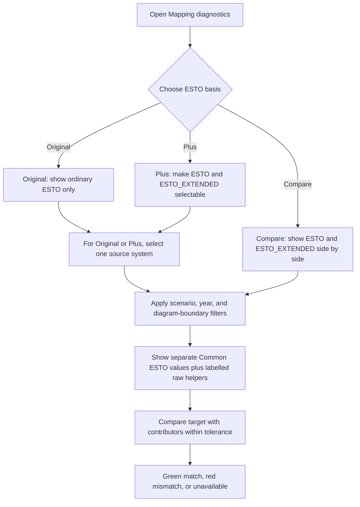

# Handover: Mapping diagnostics development

Updated: 2026-07-27

## Purpose

The Mapping diagnostics page is a read-only, static HTML diagnostic page for
understanding how raw ESTO, 9th Outlook, LEAP, and Common ESTO structures relate.
It is intentionally separate from the production chart pages: its job is to make
mapping and hierarchy evidence inspectable, not to present final model results.

Current prototype output:

```text
outputs/prototypes/transformation_rollup_diagnostics/dashboards/mapping_diagnostics.html
```

The production dashboard also renders the same page under each economy's
`dashboards/` output directory.

## Main entry points

| Area | File | Role |
| --- | --- | --- |
| Diagnostics page renderer | `codebase/common_esto_dashboard_mapping_diagnostics.py` | Builds the self-contained HTML, rollup cards/SVG, anchor sections, and mapping QA tables. |
| Production dashboard workflow | `codebase/common_esto_dashboard_workflow.py` | Loads Common ESTO data, invokes the diagnostics page renderer, and adds the page to dashboard navigation. |
| Lightweight USA prototype renderer | `scripts/render_transformation_rollup_diagnostics_prototype.py` | Regenerates the page above without running the entire dashboard. |
| Full mapping tree explorer | `scripts/render_full_mapping_tree_explorer.py` | Renders the separate interactive original-source / ESTO / Common ESTO tree explorer. |
| Diagnostics tests | `tests/test_mapping_diagnostics_page.py` | Focused renderer tests. |

The mapping inputs and generated Common ESTO data live in the sibling repo:

```text
C:\Users\Work\github\leap_mappings
```

Read `leap_mappings/docs/mappings_system.md` before changing mapping semantics.

## Current diagnostics page

The page currently contains:

- A short guide to hierarchy/anchor terminology.
- Collapsible **All rollup boundaries** cards, showing parent, children,
  siblings, contributors, rollup mode, and reconciled values.
- A zoomable/pannable **All sector rollup structure** SVG. It includes all
  Common ESTO flow hierarchy levels and all registered ESTO rollup boundaries.
- Collapsible hierarchy-failure, aggregate mismatch, exception, and mapping
  coverage sections.
- Paired raw-source versus mapped-Common-ESTO views for NINTH and LEAP anchor
  cases.
- A separate **Full mapping tree explorer** page linked from the dashboard.

The SVG and rollup-boundary cards share Dataset, Scenario, and Year controls.
Values are green only when a rollup target equals the listed contributors within
tolerance; red means a mismatch; unavailable values are not treated as failures.

## ESTO Extended behaviour

The diagnostics page uses ordinary ESTO by default. The full-tree SVG has an
**ESTO basis** selector:

- **Original ESTO only** excludes Extended-only nodes and values.
- **ESTO + ESTO Extended** makes both datasets available, but the Dataset
  selector still displays one source at a time.
- **Compare ESTO vs Extended** locks the Dataset selector and displays the two
  sources side by side. It does not add their values.
- Ordinary and Extended ESTO are never summed together for a reconciliation
  check.
- The page includes separately labelled raw helper values (`ESTO_RAW` and
  `ESTO_EXTENDED_RAW`) so rollup contributors can be shown even when they do
  not exist as standalone Common ESTO flow labels.



The basis control changes visibility and comparison presentation, not
aggregation. Raw helper values provide evidence without becoming extra
contributors to either Common ESTO total.

The page payload is deliberately limited to flow labels that appear in the SVG
or rollup boundaries. Do not embed all Common ESTO comparison rows in the HTML:
the Extended scopes make that static file unnecessarily large.

The Extended source data will be fully correct only after the mapping-pipeline
artifact is rebuilt using the source-identity fix in `leap_mappings` commit
`eb3a293` (`codex: preserve ESTO Extended rollup source identity`). Before that
rebuild, existing artifact values can still reflect the earlier duplicate-label
problem.

## Recent fixes and commits

| Repo | Commit | Change |
| --- | --- | --- |
| `leap_mappings` | `eb3a293` | Generated ESTO Extended rollups now retain `ESTO_EXTENDED`, rather than leaking into ordinary ESTO comparison scopes. |
| `leap_dashboard` | `f128456` | Added the diagnostics-page Extended toggle, raw Extended contributor values, compact payload filtering, test coverage, and documentation. |

The diagnostic found the original bug using `20_USA`, 2023 electricity plants:
raw contributors totalled `-17,096.58`, while the Common ESTO target was exactly
double at `-34,193.16`. The dashboard was reporting the underlying Common ESTO
artifact correctly; it was not double-counting in the browser.

## Additive update: current anchor and mapping-integrity state (2026-07-27)

Do not replace the rollup/Extended work above. This section records additional
Mapping diagnostics work and the current mapping-pipeline provenance.

### Fresh anchor results are now available

`leap_mappings` has since completed a real source-parent anchor-validation run:

```text
run_id: common_esto_20260727T034511926826Z
input: results/common_esto/common_esto_comparison_data.csv
detail status counts: 183,367 passed; 5,467 failed; 1,156,204 skipped
```

The summary includes the new Extended scopes:

- `esto_extended_leap` (LEAP: 183 failed);
- `esto_extended_leap_ninth` (LEAP: 175 failed; NINTH: 2,286 failed);
- ordinary ESTO scopes remain separately available.

This supersedes the earlier `MemoryError`-skipped anchor run. The older
dashboard batch was rendered before this result, so regenerate the dashboard
before interpreting its anchor cards or failure counts as current.

The renderer still needs a defensive status treatment: if a future anchor run
is skipped, do not render `Failed anchor checks: 0` as though validation passed.
Read `source_parent_anchor_validation_summary.csv` and show the skipped/error
reason prominently instead.

### Mapping-integrity sections added to the renderer

`common_esto_dashboard_mapping_diagnostics.py` also now renders the following
conditional tables inside Direct mapping coverage review:

- **Mapped target ancestor overlaps**: one source pair reaches both a Common
  ESTO target and its target-tree descendant.
- **Source parent and child mapped to one target**: one Common ESTO target is
  reached by both a source-tree parent and its descendant. This is a review
  signal, not proof that the routes should be added.
- **Active many-to-many mapping conflicts**: sourced from the canonical
  `leap_mappings/results/maintenance/many_to_many_conflicts.csv` artifact.

These are mapping-workbook integrity checks. They are global and should remain
visible with an explicit "mapping-workbook integrity" label when an ESTO
Extended view is selected; they do not become Extended-specific merely because
the comparison basis changes.

### Follow-up dashboard backlog

> **Merged into [`work_queue.md`](work_queue.md) on 2026-07-28** as `DASHQ-020`
> through `DASHQ-024`, in the same order: structural compilation health,
> non-expanding rollup integrity, material non-zero mapping gaps, candidate
> readiness, and crosswalk target conflicts / duplicate mappings. Each keeps its
> original constraint — clean means exists-and-empty, expose violations rather
> than successful checks, rank by magnitude, never write candidates to the
> workbook, and classify duplicates before presenting them as errors.
>
> These diagnostics must still be added only from their canonical
> mapping-pipeline artifacts.

The design rule below is not a backlog item and still applies.

For a future ESTO Extended checkbox, basis-dependent diagnostics must use real
parallel Extended pipeline artifacts/scopes. Do not make a control merely
relabel ordinary ESTO values. The global workbook-integrity sections above stay
visible for both bases.

## Additive update: pipeline health report and a confirmed upstream defect (2026-07-27, later session)

Do not replace the sections above. This records a second 2026-07-27 session that
re-ran the latest mapping results through the dashboard.

### New tool: mapping pipeline health report

```text
scripts/render_mapping_pipeline_health_report.py
outputs/prototypes/mapping_pipeline_health/mapping_pipeline_health.html
tests/test_mapping_pipeline_health_report.py
```

A fast, standalone investigation page built only from the small summary and QA
artifacts, so it never loads the 887 MB comparison file. It is complementary to
the Mapping diagnostics page: that page explains one economy's rollup
arithmetic, this one answers whether the latest pipeline run can be trusted at
all. It renders in a few seconds.

Its reporting rules, which the diagnostics page should adopt:

- `skipped` is rendered as "not validated", never as a pass. The product-axis
  hierarchy check is skipped in the current run and is shown as such.
- A QA file is called clean only when the file exists and is empty. A missing
  file is "unknown".
- Anchor counts are never summed across overlapping comparison scopes. Subtotals
  are shown per scope, under an explicit ordinary/Extended basis label.
- Material mapping gaps are ranked by absolute magnitude, with an explicit note
  that LEAP aggregate branches are expected to have no direct ESTO pair.
- **Pipeline code versus artifacts**: the report runs `git log` over
  `leap_mappings/codebase/` and fails loudly when any pipeline-code commit is
  newer than the artifacts on disk. Artifact mtimes are read as local time
  (`pd.Timestamp.fromtimestamp`) so they compare correctly with local git dates.

The second `*_body.html` output is the same content as a body fragment, for
publishing without re-rendering.

### Publishable page fragments and shared provenance

```text
codebase/dashboard_page_fragment.py
codebase/mapping_pipeline_provenance.py
tests/test_dashboard_page_fragment.py
```

`write_body_fragment()` converts a rendered standalone page into a body fragment
(no doctype/`<html>`/`<head>`/`<body>`, styles inlined, relative links to sibling
pages neutralized because a published fragment has no siblings). External links
and in-page anchors are preserved. The diagnostics prototype renderer now emits
`mapping_diagnostics_body.html` automatically beside its normal output, so
publishing a snapshot is no longer a hand conversion.

`mapping_pipeline_provenance.py` is the single source of truth for "were these
artifacts built by current code?". It reads the Stage 3 manifest and compares
artifact write times against `leap_mappings` `codebase/` commit dates. Both the
health report and the prototype renderer import it, so they cannot disagree.
The prototype's snapshot banner is generated from it rather than hand-written:
with the current artifacts it reads "Snapshot, and the source artifacts were
produced by superseded code", naming run
`common_esto_20260727T034511926826Z` and commit `eb3a293`. After a clean rebuild
the same code path produces an informational banner instead.

Timestamps must stay local (`artifact_mtime()` uses
`pd.Timestamp.fromtimestamp`). Reading them as UTC silently shifts them by the
local offset and produces false "superseded code" positives.

### Historical incident: ordinary-ESTO rollup values were doubled (resolved)

The diagnosis below is retained because it is a useful example of the dashboard
correctly exposing an upstream data defect. It describes the artifact generation
`common_esto_20260727T034511926826Z`; it does **not** describe the current
artifacts.

The 2026-07-27 prototype re-render reproduced the electricity-plants doubling.
It was not a dashboard bug. At the time, the following was verified directly
against that generation:

- Commit `eb3a293` landed at 14:14 local. The artifacts were written at 12:39
  and Stage 3 finished at 13:38. The run predates its own fix by ~35 minutes.
- `results/mapping_relationships/esto_extended_results_exact_rows.csv.gz` contains
  840,378 rows carrying `source_system = ESTO` instead of `ESTO_EXTENDED`, across
  exactly 15 generated rollup flows (all with a `non_expanding_rollup_id`).
- Ordinary ESTO therefore counts those flows twice. For 2023,
  `09.01.01,09.02.01 Electricity plants`, the Common ESTO value is exactly
  `2.0x` the raw contributor sum in **all 21 economies**.

The fix landed in mappings commit `eb3a293`. Run
`common_esto_20260727T113042584213Z` removed the doubling (ratio 1.0 in all 21
economies) and added a guard that fails instead of publishing a doubled
artifact. A later 2026-07-28 audit measured 5,320,932 rows in
`esto_extended_results_exact_rows.csv.gz`, all identified as `ESTO_EXTENDED`,
and zero rows incorrectly identified as `ESTO`. Preserve the historical
diagnosis, but do not tell reviewers that current ordinary-ESTO values are
doubled.

### Queued work

| Prompt | Repo | Scope |
| --- | --- | --- |
| `rebuild_esto_rollup_source_identity_prompt.md` (completed prompt; no longer present on mappings `master`) | `leap_mappings` | **DONE 2026-07-27.** Run `common_esto_20260727T113042584213Z` removed the doubling (ratio 1.0 in all 21 economies) and added a guard that fails the run rather than writing a doubled artifact. |
| `docs/prompts/anchor_validation_section_rebuild_prompt.md` | `leap_dashboard` | Rebuild the anchor section: one parent boundary is one check, fuels/years nested as evidence, full filters, defensive skipped-run handling. |

### Deferred: ESTO Extended coverage findings

The 2026-07-27 rebuild also showed that the workbook's 730 Extended mapping rows
target 56 extended-only flows while `common_esto_tree.csv` defines Common ESTO
rows for only 5, so the diagnostics page shows exactly one Extended detail flow
(`09.01.02.01 Coal CHP`). That is parked as probable work-in-progress — the ESTO
Extended dataset was still being built — and is scheduled for a re-measure in
`leap_mappings/docs/revisit_mapping_diagnostics_20260817.md` rather than treated
as a defect now.

Do not read the current Extended views as evidence that Extended coverage is
broken, and equally do not read them as evidence it is complete. Until that
re-measure, the honest statement is that Extended detail is largely not yet
represented in Common ESTO.

## How to render and test

Use the Windows Miniconda interpreter:

```powershell
C:\Users\Work\miniconda3\python.exe -m pytest tests\test_mapping_diagnostics_page.py tests\test_mapping_pipeline_health_report.py -q
C:\Users\Work\miniconda3\python.exe scripts\render_transformation_rollup_diagnostics_prototype.py
C:\Users\Work\miniconda3\python.exe scripts\render_mapping_pipeline_health_report.py
```

Browser automation is still blocked for `file:///` outputs. Serving the outputs
directory over localhost works and is the quickest way to inspect a rendered
page:

```powershell
C:\Users\Work\miniconda3\python.exe -m http.server 8731 --bind 127.0.0.1
```

### Rendering from a mapping-pipeline worktree

The mapping pipeline can be run from a `leap_mappings` git worktree so the main
checkout stays free for other work. A worktree writes its own `results/`, so
point the dashboard at it explicitly:

```powershell
$env:LEAP_MAPPINGS_ROOT = "C:\Users\Work\github\leap_mappings\.claude\worktrees\<name>"
C:\Users\Work\miniconda3\python.exe scripts\render_mapping_pipeline_health_report.py
```

Both renderers honour `LEAP_MAPPINGS_ROOT`. It fails loudly when the path has no
`results/` directory, rather than silently reporting the main checkout's
artifacts while appearing to describe the worktree run. Unset it to go back to
the main checkout.

Setting up a runnable worktree (`data/` and `results/` are gitignored, so a fresh
worktree has only stubs; `config/` workbooks *are* tracked and need no copy):

1. Hardlink the three pipeline inputs from the main checkout's `data/`
   (`00APEC_2025_low_with_subtotals.csv`, `esto_extended.csv`,
   `merged_file_energy_ALL_20251106.csv`, ~331 MB). The pipeline only reads
   these, so a hardlink costs no disk. Do **not** hardlink anything the pipeline
   writes — `to_csv` truncates the shared inode and would corrupt the main
   checkout's copy.
2. Copy (do not hardlink) the Stage 1/2 outputs a `data_convert`/Stage 3 run
   reads, ~120 MB: `mapping_relationships/energy_balance_relationships.csv`,
   `raw_leap_results.csv`, `non_expanding_rollups.csv`, `rollup_edges.csv`,
   `common_esto/common_esto_rows.csv`, `common_esto_row_components.csv`,
   `esto_to_common_esto_map.csv`, `common_esto/structural_artifacts/`, and the
   small `tree_structure/*_tree.csv` / hierarchy-edge files.
3. Set `LEAP_BALANCE_EXPORTS_ROOT`. `run_mapping_pipeline.py` resolves the raw
   LEAP exports relative to the repo root's parent at *import* time, which in a
   worktree resolves to `.claude/worktrees/leap_initialisation` and raises
   `FileNotFoundError` before any stage runs — even for stages that never touch
   LEAP exports:

   ```powershell
   $env:LEAP_BALANCE_EXPORTS_ROOT = "C:\Users\Work\github\leap_initialisation\data\leap balances exports"
   ```

A full `data_convert` plus Stage 3 in a worktree generates roughly 4 GB of its
own artifacts, duplicating the main checkout's large outputs. Clean the worktree
`results/` when the run is no longer needed.

The prototype renderer chunk-reads large files. It is safe for a focused page
render, but it is not a replacement for rebuilding Common ESTO artifacts.

Avoid running the full ESTO Extended pipeline merely to inspect this page; that
has previously caused memory pressure. When the mapping artifacts must be
corrected, rebuild them in the `leap_mappings` workflow first, then rerender the
dashboard.

## Next development work

### 1. Anchor validation section

The current anchor sections are evidence-rich but still hard to navigate. The
next agent should:

1. Start from `source_parent_anchor_validation.csv`,
   `source_parent_anchor_child_context_values.csv`, and
   `source_parent_anchor_mapped_component_context_values.csv` in
   `leap_mappings/results/tree_structure/`.
2. Keep one parent boundary as one check/failure; fuels and years should be
   evidence nested beneath it rather than headline failure counts.
3. Add clear filters for source system, comparison scope, economy, scenario,
   year, validation axis, and status.
4. Keep raw parent/child values visually distinct from mapped Common ESTO
   frontiers. Do not imply that a source-data contradiction is a missing map.
5. Preserve the existing reviewed-exception section. Exceptions must remain
   visible and must not silently disappear from the evidence.

Useful current helpers are `_paired_anchor_aggregate_summary()`,
`_paired_tree_html()`, and the summary functions near the top of
`common_esto_dashboard_mapping_diagnostics.py`.

### 2. Full mapping tree explorer

The explorer already offers source-tree selection, year/scenario selectors,
mapping-label modes, node search, and an ESTO Extended preference checkbox.
The next agent should make its relationship to the diagnostics page clearer:

1. Use the same source terminology and Extended inclusion/exclusion semantics
   as Mapping diagnostics.
2. Make it obvious that the three columns are: original source hierarchy,
   original ESTO component hierarchy, and Common ESTO representation.
3. Show mapping routes and cardinality warnings without presenting repeated
   routes as additive values.
4. Add a direct link from a rollup boundary/card to the relevant explorer node
   only if the link can carry a stable flow identifier and preserve the selected
   source/year/scenario context.
5. Keep the tree explorer separate from the page's rollup arithmetic: it is a
   structural navigation tool, not a second total-calculation engine.

### 3. General page quality

- Prefer small, explicit controls over hidden default behaviours.
- Keep static HTML self-contained, but filter embedded records to the elements
  actually rendered.
- Do not change mapping workbook rows from the dashboard repo.
- Do not treat parent, child, and generated rollup rows as one additive total.
- Add focused renderer tests for every new interaction and rerender the USA
  prototype for visual review.

## Known limitations

- The mapping diagnostics renderer currently uses a large embedded JavaScript
  template and post-render string replacement. Make targeted edits and retain
  the focused tests; a larger refactor should be planned rather than slipped
  into a UI change.
- Browser automation may be blocked for `file:///` dashboard outputs. Static
  HTML checks, focused tests, and manual refresh in the in-app browser are the
  current verification route.
- The earlier rendered artifacts may contain stale values from before the
  `leap_mappings` Stage 3 rebuild after commit `eb3a293`. The current mapping
  outputs have been rebuilt, but each dashboard economy must be rerendered to
  consume them.

## Additive review: full-tree explorer implementation (2026-07-27)

The handover correctly identifies the explorer as a separate structural tool.
The following implementation exists in a distinct sequence of dashboard
commits and should be retained alongside the diagnostics-page work:

| Commit | Explorer addition |
| --- | --- |
| `a090166` | Full source / ESTO component / Common ESTO tree explorer and normal workflow output. |
| `abff12a`, `c472af0`, `91cb39e` | Numeric route overlay; fixed context years (2022, 2030, 2040, 2060); scenario and magnitude controls. |
| `55de945` | Separate positive output, negative input, and net values for transformation inspection. |
| `a1b2020` | Optional abbreviated node labels for original ESTO-component or Common ESTO targets. |
| `0841214`, `0a1daff` | Conditional ESTO Extended readiness and explicit checkbox control. |

### Explorer behaviour that must remain clear

- `scripts/render_full_mapping_tree_explorer.py` is the active full-tree
  renderer. The older `render_mapping_tree_explorer_prototype.py` is the
  earlier three-case prototype and should not be extended for new work.
- `common_esto_dashboard_workflow.py` writes the explorer to each economy's
  `dashboards/mapping_tree_explorer.html` and adds it to the dashboard
  navigation. The prototype output is only for manual inspection.
- Explorer numeric values are summed over all economies for the selected
  source system, comparison scope, selected year, and selected scenario. They
  are not a new validator calculation. Repeated `common_row_id` values are
  counted once in its selected-node summary.
- The middle panel is the actual ESTO component hierarchy used to establish
  real parent/child target edges. The right panel is the Common ESTO flow
  hierarchy. Do not collapse those into one tree or imply that a mapping route
  is a hierarchy edge.
- The **Use ESTO Extended instead of ESTO** checkbox appears only when the
  generated comparison input contains `source_system = ESTO_EXTENDED`.
  `COMMON_ESTO_PREFER_EXTENDED_ESTO=true` checks it by default. It is
  intentionally hidden with the current ordinary-ESTO-only artifact, rather
  than pretending ordinary ESTO values are Extended values.

### Review recommendations before further explorer work

1. Add focused tests for the full-tree renderer before changing its embedded
   JavaScript again. Existing diagnostics tests do not exercise its selectors.
2. After an Extended pipeline run, render once with a real `ESTO_EXTENDED`
   payload and verify the checkbox, source tree, mapping routes, and values
   together. The current conditional branch has a small synthetic render check
   but not an end-to-end Extended artifact test.
3. Consider replacing the tree renderer's large embedded JSON/JavaScript
   template only as a planned refactor. For now, make surgical changes and
   retain the distinction between source, ESTO-component, and Common ESTO
   structures.
